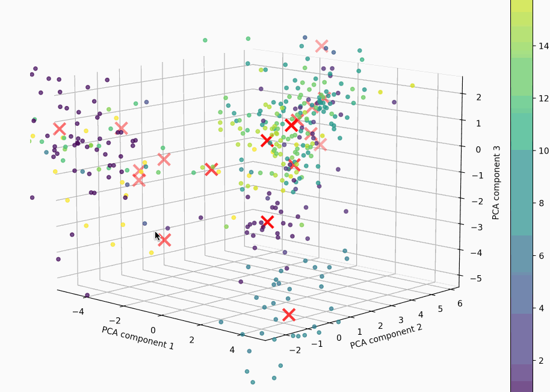

# AI any text clusterer & sorting
* Why: When your log files are very large and there are so many of them, and you don't know where to start, you can use ai-any-text-clusterer to classify your logs or files, git logs and other texts, so that you can clearly see where the relevant information is.

## Feature

- [x] File clustering (matching rules)
- [x] Filter markdown todos
- [x] Git log clustering
- [ ] Log clustering
- [ ] File sorting
- [ ] Visualization operate & process
- [ ] Support GPT ask for search or sorting

## Init

* Setup python env
```sh
conda create -n ai-any-text-clusterer python=3.11
conda activate ai-any-text-clusterer
poetry install
```
* [Ollama](https://ollama.com/) run embed model
```sh
ollama run nomic-embed-text
```

## Usage
* command
```sh
# function name: find_files_with_chinese_names, get_todo_items, get_git_log, ...
# When there are a lot of content or files, it is recommended that the n_clusters value is larger, such as 20. When there are fewer files, the n_clusters value is recommended to be 5
python ai_any_text_clusterer.py <function_name> <index_file_name> <n_clusters>
```
* run git log clusterer
```sh
$ ai-any-text-clusterer  main @ poetry run python ai_any_text_clusterer.py get_git_log get_git_log.index 5
Loading embeddings from FAISS index...
Group 1:
  [f9816067d95d20ba18cf3e8238ca3c0be252866e] Add git log
  [9712fbd2c4611230b666dd3a02ee0bd76d832c68] https://ollama.com/ install embed model
  [b519b481cf68833a116eb79e250a22b8ca02c2e5] Filter markdown todos
  [338e72e4e42eef9900eba7749dc88dee302d735e] Add visualization.gif

Group 2:
  [c23c23bfa72af712153fdd0596f19472acfb7f2b] Add Usage
  [99e49f6f0b165e5c6058ca9b7828170e9006ac73] Add why

Group 3:
  [631d8cd8c50a2989100a951c06e3bfb5cc6d8fea] Add function_name and index_file_name
  [7b26ecf07645522e40375779fd1e720a9f293a9a] add find_files_with_chinese_names
  [b1b515937cccfa5dff9b482e79bfa6dd14f96078] Add files classifier

Group 4:
  [c5bd5863e0ade7a558b1bf8eb8367416e7305df3] rename
  [31bef97ccda56f8b1989bc555ca4fd7a9d537f53] rename
  [55d4057cbd775beb910363e6902dbab534a65000] rename

Group 5:
  [c9f8e2351e0c456feb7c30754d261ba42505ec87] Add setup, use poetry
```

## Visualization


